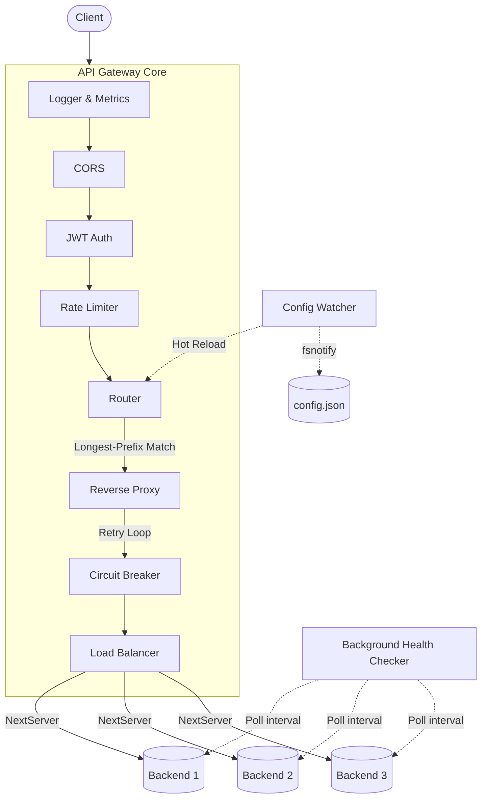

# Custom Layer 7 API Gateway & Load Balancer

## Project Overview

A high-performance and lightweight Layer 7 API Gateway built natively in Go. The gateway handles dynamic routing, intelligent load balancing, active health checking, and critical edge features like rate limiting, JWT authentication, and CORS management.

## Architecture

The gateway processes incoming requests through a strict middleware pipeline before routing them to healthy backend servers.



## Quickstart

### Prerequisites
- [Go 1.22+](https://golang.org/doc/install)

### Running Locally

1. **Install dependencies:**
   ```bash
   go mod download
   ```
2. **Start the gateway:**
   ```bash
   go run cmd/gateway/main.go
   ```
   The gateway runs on `localhost:8080` (or the port specified in `config.json`).
3. **Hot-Reloading:**
   Modify `config.json` while the server is running to see changes automatically applied with zero downtime!

### Load Testing
A pre-configured `k6` script (`test.js`) is included to test the gateway's performance.
```bash
k6 run test.js
```

## Configuration Reference

The gateway is entirely configured via a `config.json` file. Changes to this file are automatically detected via `fsnotify` and reloaded with zero downtime.

```json
{
  "server": {
    "port": 8080,
    "read_timeout": "15s",
    "write_timeout": "15s",
    "tls": {
      "enabled": false,
      "cert_file": "",
      "key_file": ""
    }
  },
  "middleware": {
    "cors": {
      "allowed_origins": ["*"],
      "allowed_methods": ["GET", "POST", "PUT", "DELETE", "OPTIONS"],
      "allowed_headers": ["Content-Type", "Authorization"]
    },
    "jwt": {
      "secret": ""
    },
    "rate_limit": {
      "requests_per_second": 2,
      "burst": 5,
      "cleanup_interval": "1m",
      "ttl": "5m"
    }
  },
  "routes": [
    {
      "path_prefix": "/users",
      "strip_prefix": true,
      "balancer": "round_robin",
      "backends": [
        { "url": "https://jsonplaceholder.typicode.com", "weight": 1 },
        { "url": "https://dummyjson.com", "weight": 2 }
      ]
    },
    {
      "path_prefix": "/products",
      "strip_prefix": false,
      "balancer": "least_conn",
      "backends": [
        { "url": "https://api.restful-api.dev", "weight": 1 }
      ]
    }
  ],
  "health_check_path": "/health",
  "retry_max_attempts": 3,
  "retry_base_delay": "100ms",
  "retry_max_delay": "2s",
  "cb_failure_threshold": 3,
  "cb_success_threshold": 2,
  "cb_timeout": "5s"
}
```

## Load Testing

A [k6](https://k6.io/) script (`test.js`) load-tests the gateway:
```bash
k6 run test.js                                     # targets http://localhost:8080 by default
k6 run -e BASE_URL=http://host:PORT test.js         # override the target
```

### Results

Measured 2026-08-28 on an Apple M3 (8 cores), macOS 26.0.1, go1.27.0 darwin/arm64.
Setup: the gateway fronting two local Go backends that immediately return `200 OK` (**not** the internet-dependent routes in the committed `config.json` — hitting a real upstream would benchmark that upstream's network latency, not the gateway). 100 concurrent virtual users for 10 seconds against a round-robin route.

| Metric | Result |
|---|---|
| Total requests | 341,925 |
| Throughput | ~34,185 req/s |
| Success rate | 100% (0 failed) |
| Avg latency | 2.88 ms |
| p95 latency | 6.72 ms |

This is one run, on one machine, against backends that do nothing but return `200 OK` — no TLS, no real work on the backend side. It shows the gateway's own overhead, not a production capacity guarantee. To reproduce: point two routes in a `config.json` at local backends that return `200 OK` immediately, `go build -o gateway ./cmd/gateway && ./gateway`, then run `k6 run -e BASE_URL=http://localhost:PORT test.js`.

**Note:** an earlier attempt at this benchmark used `python3 -m http.server` as the backend and saw a 13% failure rate. That turned out to be the backend, not the gateway — but chasing it down surfaced a real bug: `internal/proxy` was proxying through `http.DefaultTransport`, whose default cap of 2 idle connections per host starves a reverse proxy that fans many concurrent client requests into a handful of backend hosts. Fixed by giving `GatewayTransport` its own `http.Transport` with `MaxIdleConnsPerHost: 100` (`internal/proxy/proxy.go`).

## Metrics

The gateway exposes a `/metrics` endpoint in Prometheus text exposition format: total requests, requests broken down by response status code, and per-backend circuit breaker state (`0` = closed/healthy, `1` = open/down, `2` = half-open/testing). It's a small hand-rolled counter set (`internal/metrics`), not a full Prometheus client integration — no histograms, no scrape-config tooling — but it's enough to watch request volume and backend health during a demo or under load:
```bash
curl http://localhost:8080/metrics
```

## Extending the Gateway

### Adding a New Balancer Strategy

1. **Implement the `Balancer` interface:**
   Create a new file in `internal/balancer/` and implement the required methods.
   ```go
   type Balancer interface {
       NextServer() (*health.Backend, error)
   }
   ```

2. **Register it:**
   Open `cmd/gateway/main.go` and add your algorithm to the `buildRoutesAndPoller` function:
   ```go
   if routeCfg.Balancer == "least_conn" {
       b = balancer.NewLeastConnections(routeBackends)
   } else if routeCfg.Balancer == "ip_hash" {
       b = balancer.NewIPHash(routeBackends) // <-- Your custom strategy
   } else {
       b = balancer.NewWeightedRoundRobin(routeBackends)
   }
   ```

3. **Update config:**
   Set `"balancer": "ip_hash"` in your `config.json`.
